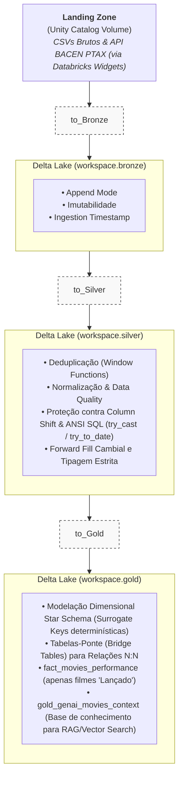

# Contexto Organizacional e Estilo de Engenharia
Perspetiva de Equipe (Uso da Primeira Pessoa do Plural):A redação da documentação e os artefactos técnicos foram desenvolvidos adotando a primeira pessoa do plural ("nós", "decidimos", "construímos") para refletir o alinhamento com uma equipa multidisciplinar de Engenharia e Governação de Dados em contexto empresarial.Interpretação de Requisitos de Negócio:Todas as especificações técnicas, limpezas estruturais e regras analíticas foram interpretadas e endereçadas como requisitos funcionais e não-funcionais corporativos do ecossistema fictício CineData.Comentários Baseados em Decisão de Arquitetura (Decision-Driven Comments):Em todos os notebooks (Landing_to_Bronze, Bronze_to_Silver e Silver_to_Gold), cada bloco de código inclui cabeçalhos estruturados com a secção explicita "DECISÃO". Estes comentários registam a justificação técnica de desenho, impactos de governança, mitigações de erros operacionais (ANSI SQL compliance) e compromissos assumidos.   

